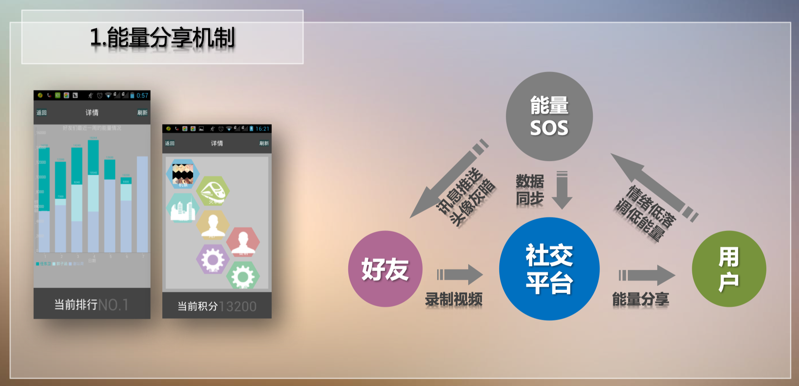
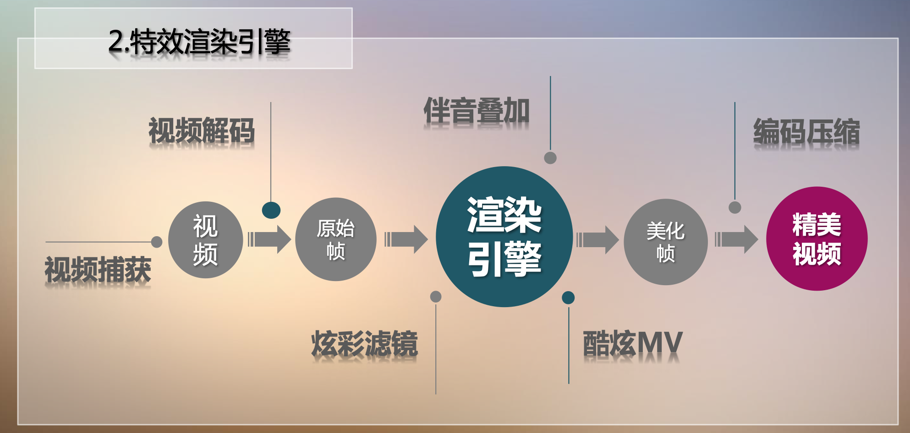
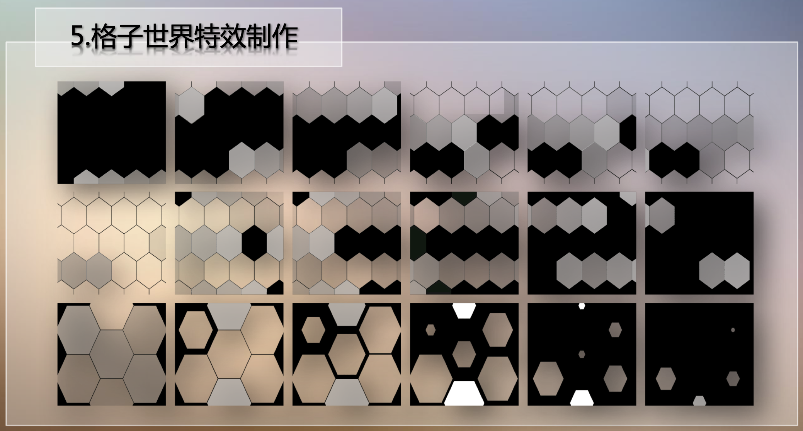
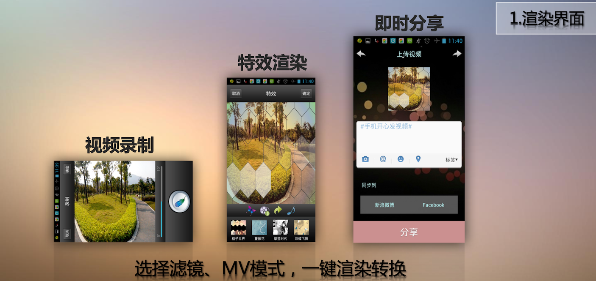
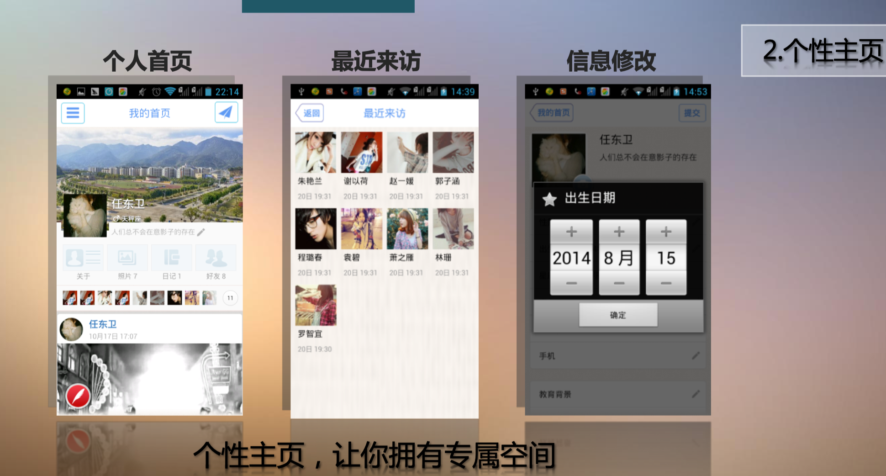
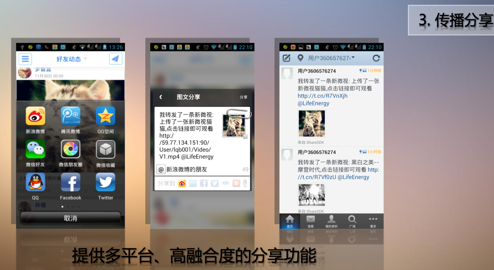

# LifeEnergy
This is an android social network app for video sharing. This app includes several modules to make it self-contained, e.g., user generated content(UGC), personal video recommendation, cross-platform sharing and an energy promoting mechanism.

Specially, we also integrate a new video effect redering engine into this app. The rendering engine utilizes FFMPEG C library to decode the video to raw images and encode the filtered images to the new video, and exposes the C interfaces to JAVA through Java Native Interface (JNI). This ensures sufficiently fast video processing performance. We also design several effects for image filtering and video animation. Details can be seen from our another repository (https://github.com/QibingLee/VideoEffectRendering).

## Notice
It is built five years ago, and therefore some functions may be deprecated.

## Platform Technical Details
The system architecture:

Specific technical details:

The energy promoting mechanism:

## Rendering Engine Technical Details
The rendering procedure of video effect:

The animation resources for “lattice world” effect (in ./effects folder, @hexogon_pattern):

## Demo
You also can watch the youtube video for this engine:

https://www.youtube.com/watch?v=1cEIneTFN0U

https://www.youtube.com/watch?v=7lzg2ES1MxU

https://www.youtube.com/watch?v=g1fMsfgPgxU

https://www.youtube.com/watch?v=iM-MYYpxxsI

